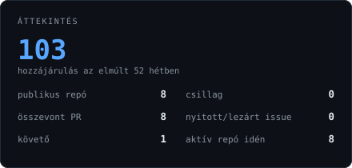
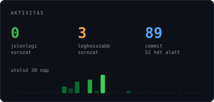
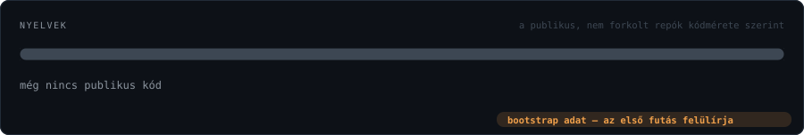
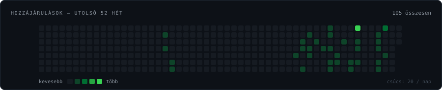

 





---

### Amivel dolgozom

**Magic xpa / xpi** · **C# / .NET** · **JavaScript / Node** · **SQL** · **HTML/CSS**

### Kiemelt munka

**[arnyekolo-konfigurator-poc](https://github.com/bogszibarack/arnyekolo-konfigurator-poc)** — B2B árnyékolástechnikai konfigurátor: konfigurálás → ajánlat → rendelés.
Modulokra bontott demó üzenetbusszal, adatvezérelt szabálymotorral és ár-pillanatképpel, mellette 24 oldalas megvalósítási terv és nyolc regressziós árteszt.

---

<details>
<summary><b>Hogyan készül ez az oldal?</b></summary>

<br>

Ez a README nem kézzel frissül. Minden éjjel `03:17 UTC`-kor lefut egy GitHub Action, ami

1. lekéri a GitHub GraphQL API-ról a statisztikát → `data/stats.json`
2. abból megrajzolja az öt SVG-t → `assets/*.svg`
3. és csak akkor commitol, ha tényleg változott valami.

```
scripts/portrait.py        egyszeri: fotó -> ASCII-rács (OpenCV)
scripts/subset_font.py     egyszeri: JetBrains Mono -> base64 woff
scripts/generate_stats.py  éjszakánként: GraphQL -> data/stats.json
scripts/render_svgs.py     éjszakánként: stats.json + portrait.txt -> assets/*.svg
```

**Miért van a betűtípus base64-ként beleégetve az SVG-be?**
A GitHub a README-ben ``-ként rendereli az SVG-t, az ``-be zárt SVG pedig nem tölt le külső erőforrást: se webfontot, se képet, és JavaScript sem fut benne. Az ASCII-portré viszont csak akkor áll össze képpé, ha minden karakter pontosan ugyanolyan széles — ezért a betűtípus (leszűkítve a ténylegesen használt ~140 jelre) bele van írva a fájlba. Animációra a SMIL `<animate>` marad, az működik.

**Miért van minden kártyának saját sötét háttere?**
Mert az ``-SVG nem tudja megkérdezni, hogy a GitHub épp világos vagy sötét témában van-e. A `prefers-color-scheme` az operációs rendszer beállítását olvasná, ami simán eltérhet a GitHub témájától — és akkor sötét lapon sötét szövegű kártya lenne. A saját háttér mindkét témában ugyanazt adja.

**Miért nem futtatja a workflow a portré-szkriptet?**
Mert az OpenCV-t igényel, a fotó pedig nem változik. Az ASCII-rács egyszer készül el, és `data/portrait.txt`-ként verziókövetett. Az éjszakai futásnak így nincs `pip install` lépése — nincs mitől eltörnie.

**Miért nem ingadoznak a számok?**
Az időablak egész UTC-napokra van rögzítve (nem „most mínusz 365 nap"), a repó-lekérdezés pedig `privacy: PUBLIC` szűrőt kap. Enélkül minden futás más eredményt adna, és minden éjjel keletkezne egy zajos commit.

</details>

<sub>Az ASCII-portré a <a href="https://github.com/bogszibarack/bogszibarack/blob/main/scripts/portrait.py">scripts/portrait.py</a> kimenete. A betűtípus <a href="https://github.com/JetBrains/JetBrainsMono">JetBrains Mono</a> (SIL Open Font License 1.1).</sub>
